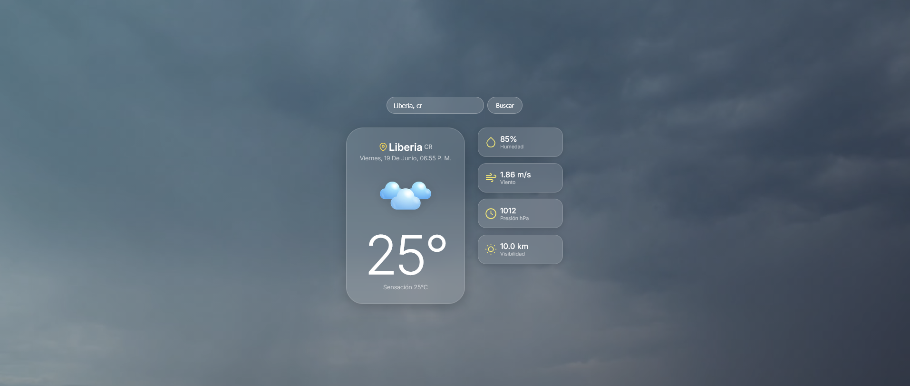
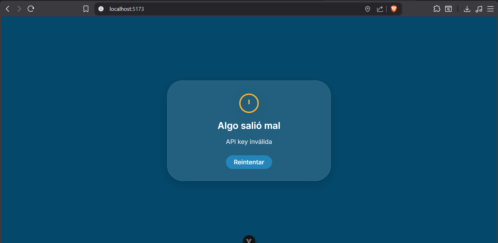

# ClimaVue — App del Clima con Vue 3 | Grupo G1

Aplicación del clima en tiempo real con geolocalización, búsqueda de ciudades, historial persistente, videos de fondo dinámicos y diseño glassmorphism. Construida con **Vue 3** + **Vite** como parte de la investigación de Frameworks para la Universidad de Costa Rica.

---

## Demo

> URL de la demo: *pendiente de publicar en Vercel*

Al cargar, la app solicita permiso de ubicación y muestra automáticamente el clima de tu ciudad actual. Si se deniega el permiso, muestra San José, Costa Rica como ciudad por defecto.

---

## Framework Usado

- **Vue 3** — Composition API con `<script setup>`
- **Vite** — Build tool y dev server
- Sin librerías de componentes UI externas (Vuetify, Bootstrap, Material UI, etc.) — todo CSS custom

---

## Características Implementadas

Todas las 6 funcionalidades requeridas están completas:

| # | Funcionalidad | Estado |
|---|---|---|
| 1 | Buscador de ciudad con campo de texto, botón y búsqueda al presionar Enter | ✅ |
| 2 | Datos del clima actual: temperatura, descripción, humedad, viento, presión y visibilidad | ✅ |
| 3 | Historial de las últimas 5 ciudades buscadas con acceso rápido al hacer clic | ✅ |
| 4 | Estado de carga: spinner animado mientras se obtienen los datos | ✅ |
| 5 | Manejo de errores: mensaje claro si la ciudad no existe o hay fallo de red | ✅ |
| 6 | Persistencia del historial en `localStorage` al recargar la página | ✅ |

### Funcionalidades adicionales

- **Geolocalización automática** con fallback a San José, Costa Rica
- **Autocomplete de ciudades** al escribir en el buscador (API de Geocoding de OpenWeatherMap)
- **Video de fondo dinámico** según condición climática y hora del día (11 videos `.webm`)
- **Íconos climáticos** dinámicos en formato `.webp`
- **Diseño glassmorphism responsivo** con `backdrop-filter: blur()` sobre el video de fondo

---

## Restricciones Técnicas Cumplidas

- Sin librerías de componentes UI externas
- Diseño responsivo: funciona en escritorio y móvil (breakpoints en 768px y 480px)
- API Key en variables de entorno, no expuesta en el repositorio

---

## Configuración de la API Key

1. Obtener una API Key gratuita en [OpenWeatherMap](https://openweathermap.org/api)
2. Crear el archivo `.env` en la raíz del proyecto (basado en `.env.example`):

```
VITE_OPENWEATHER_API_KEY=tu_api_key_aqui
VITE_OPENWEATHER_BASE_URL=https://api.openweathermap.org/data/2.5/weather
VITE_OPENWEATHER_GEO_URL=https://api.openweathermap.org/geo/1.0/direct
```

3. El archivo `.env` está en `.gitignore` — nunca se sube al repositorio.

---

## Setup del Proyecto

### Requisitos

- Node.js `^20.19.0` o `>=22.12.0`

### Instalación

```sh
npm install
```

### Desarrollo (con Hot-Reload)

```sh
npm run dev
```

Abrir en el navegador: `http://localhost:5173`

### Producción

```sh
npm run build
npm run preview
```

---

## Conceptos Clave de Vue 3 Utilizados

| Concepto | Dónde se usa |
|---|---|
| `<script setup>` | Todos los componentes |
| `ref` y `computed` | `useWeather.js`, `useGeolocation.js`, `useSearchHistory.js` |
| `watch` | `App.vue` (coordenadas, clima), `CitySearch.vue` (debounce) |
| `defineProps` / `defineEmits` | `WeatherDisplay`, `WeatherError`, `SearchHistory`, `CitySearch` |
| `defineExpose` | `CitySearch.vue` (expone `clear()` al padre) |
| `onMounted` | `App.vue` (inicia geolocalización) |
| Composables | `useGeolocation`, `useWeather`, `useSearchHistory` |
| Template refs | `App.vue` (`ref="citySearchRef"`) |
| `import.meta.env` | `weather.js` (variables de entorno Vite) |
| `new URL(..., import.meta.url)` | `WeatherBackground.vue` (carga dinámica de assets) |

---

## Pros y Contras de Vue 3

### Pros
- **Composition API** permite extraer lógica en composables reutilizables
- `<script setup>` reduce boilerplate comparado con Options API
- Reactividad fina con `ref` y `computed` sin dependencias externas
- Ecosistema ligero — sin necesidad de librerías UI externas para este proyecto
- **Vite** ofrece HMR instantáneo y builds optimizados
- TypeScript-ready y buena integración con herramientas modernas

### Contras
- Curva de aprendizaje para Composition API si se viene de Options API
- Dos formas de escribir componentes (Options vs Composition) puede confundir al equipo
- Ecosistema de componentes más pequeño que React
- Reactividad requiere entender cuándo usar `ref`, `reactive`, `computed`, `watch`
- Documentación a veces asume conocimientos previos de Vue 2

---

## Estructura del Proyecto

```
src/
├── App.vue                         # Orquestador principal: geolocalización, clima, historial
├── main.js                         # Entry point de Vue
├── assets/
│   ├── base.css                    # Variables CSS (design tokens)
│   ├── main.css                    # Estilos base
│   ├── videos/                     # 11 videos .webm de fondo climático
│   └── *.webp                      # 10 íconos climáticos
├── components/
│   ├── WeatherBackground.vue       # Video fullscreen con overlay de gradiente
│   ├── WeatherDisplay.vue          # Dashboard principal: temperatura y detalles
│   ├── WeatherIcon.vue             # Ícono climático dinámico
│   ├── WeatherError.vue            # Tarjeta de error con botón "Reintentar"
│   ├── LoadingSpinner.vue          # Spinner animado de carga
│   ├── CitySearch.vue              # Buscador con autocomplete y debounce
│   └── SearchHistory.vue          # Chips de historial de ciudades recientes
├── composables/
│   ├── useGeolocation.js           # Lógica de geolocalización del navegador
│   ├── useWeather.js               # Estado del clima + mapeo de assets
│   └── useSearchHistory.js        # Historial persistente en localStorage
├── services/
│   └── weather.js                  # Fetch a OpenWeatherMap API
└── utils/
    └── weatherMappings.js          # Mapeo de códigos OWM → assets locales
```

---

## Capturas de Pantalla

**Buscador de ciudad (#1)**


**Manejo de errores (#5)**


---

## Referencias

Ver [REFERENCIAS.md](./REFERENCIAS.md)
